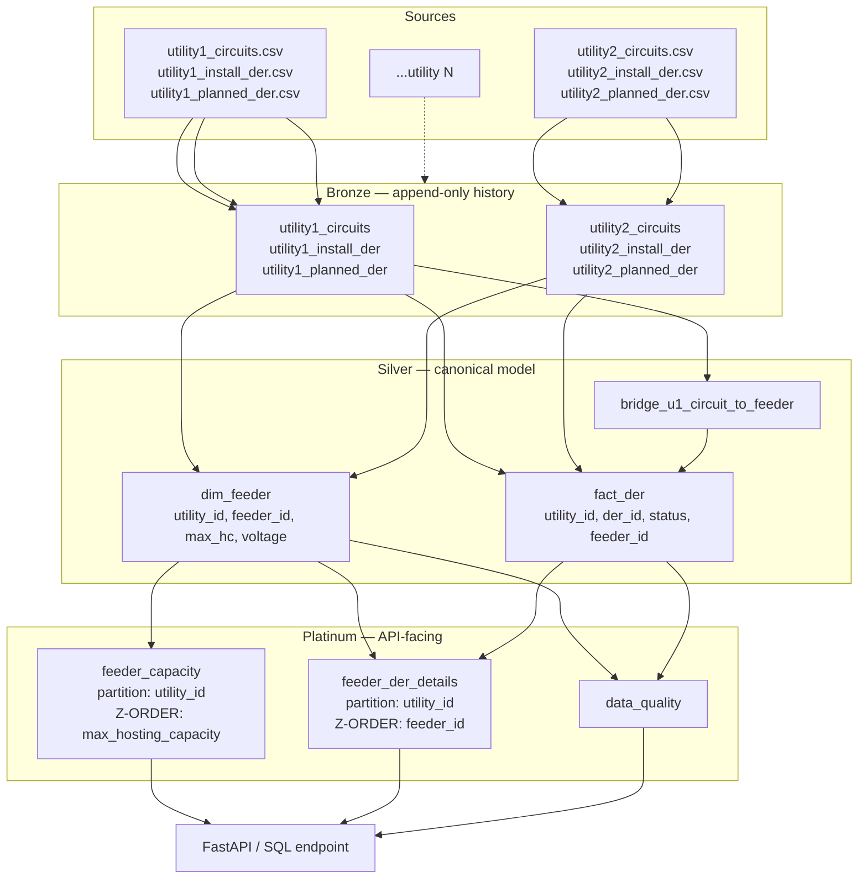

# IEDR Utility Data Lakehouse

A scalable, harmonized data platform that ingests electrical-circuit and DER (Distributed Energy Resource) data from multiple New York utilities and serves it through two API-ready queries — built on Databricks + PySpark + Delta Lake.

## What it does

Each utility delivers three CSV files per month (circuits, installed DERs, planned DERs). The pipeline normalizes them into a common data model so the IEDR application "does not have to be mindful of differences between source utility data" (case-prompt requirement) and exposes:

- **Feeder hosting capacity lookup** — every feeder where `max_hosting_capacity > X`
- **Feeder DER details** — every installed and planned DER on a given feeder, including data-quality flags for unresolved feeder IDs

## Architecture



Three layers, each Delta:

- **Bronze** — raw CSV ingestion, **partitioned by `(utility_id, batch_date)` and append-only**. Every monthly drop is preserved for audit and back-fill.
- **Silver** — utility-specific normalization → canonical `dim_feeder` and `fact_der`. Each utility's quirks live in its own adapter class + YAML config (no orchestration code changes when onboarding utility 3).
- **Platinum** — query-optimized API tables, partitioned and Z-ORDERED on the predicates the API actually filters on, plus a data-quality summary.

## Repo structure

```
iedr-utility-data-lakehouse/
├── pyproject.toml                # single source of truth for dependencies
├── databricks.yml                # DAB targets (dev/qa/prod)
├── resources/
│   └── iedr_pipeline.yml         # job definition, monthly cron, explicit cluster
├── src/iedr/                     # importable Python package — ALL logic lives here
│   ├── bronze/ingest.py
│   ├── silver/
│   │   ├── pipeline.py
│   │   └── adapters/             # one class per utility (open-closed for new ones)
│   │       ├── base.py
│   │       ├── utility1.py
│   │       └── utility2.py
│   ├── platinum/build.py
│   └── common/                   # shared: context, schemas, expectations, config
├── notebooks/                    # thin Databricks wrappers that call the package
│   ├── bronze/bronze_ingest.py
│   ├── silver/silver_transformation.py
│   └── platinum/platinum_tables.py
├── config/
│   ├── pipeline.yaml             # which utilities are active per env
│   └── utilities/
│       ├── utility1.yaml         # column mappings + DER-type encoding
│       └── utility2.yaml
├── tests/
│   ├── unit/                     # imports the real production classes
│   └── integration/              # full bronze→silver→platinum on fixture CSVs
├── serving/api.py                # FastAPI stub binding platinum to typed responses
├── docs/
│   ├── architecture.md           # data flow, scaling, design notes
│   ├── design_decisions.md       # alternatives considered, why we chose what we did
│   ├── data_dictionary.md        # column-by-column reference
│   └── runbook.md                # what to do when the job fails
└── .github/workflows/
    ├── ci.yml                    # lint + unit + integration on every push
    └── deploy.yml                # dev → qa → prod with environment gates
```

## Onboarding a new utility (the scaling story)

NY has 8 utilities; the pipeline is built so each new one is a configuration change, not a code rewrite:

1. Drop a CSV column-mapping at `config/utilities/utility3.yaml`
2. Add `Utility3Adapter(UtilityAdapter)` under `src/iedr/silver/adapters/`
3. Register it in `src/iedr/silver/adapters/__init__.py::ADAPTERS`
4. Add `utility3` to `config/pipeline.yaml` for the target env

The bronze ingest, silver orchestration, platinum build, and CI/CD workflows are untouched.

## Run tests locally

```bash
pip install -e ".[dev]"
pytest                    # all tests
pytest tests/unit -v      # fast unit tests only
pytest tests/integration  # end-to-end on fixture CSVs
```

The test suite imports the **real** production code (no re-implementations), runs in ~30 seconds with a local Spark, and is gated in CI before any deploy.

## Deploy

```bash
databricks bundle deploy -t dev    # dev — auto on merge to main
databricks bundle deploy -t qa     # qa  — gated on dev success + GitHub environment review
databricks bundle deploy -t prod   # prod — gated on qa success + manual approval
```

Credentials are stored as GitHub repository secrets and injected by the `deploy.yml` workflow. Nothing hardcoded.

## Further reading

- [Architecture](docs/architecture.md) — scaling, partitioning, and lineage
- [Design decisions](docs/design_decisions.md) — alternatives considered and why
- [Data dictionary](docs/data_dictionary.md) — column-by-column reference
- [Runbook](docs/runbook.md) — what to do when something breaks at 3 a.m.

